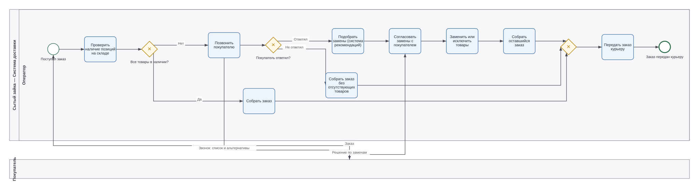
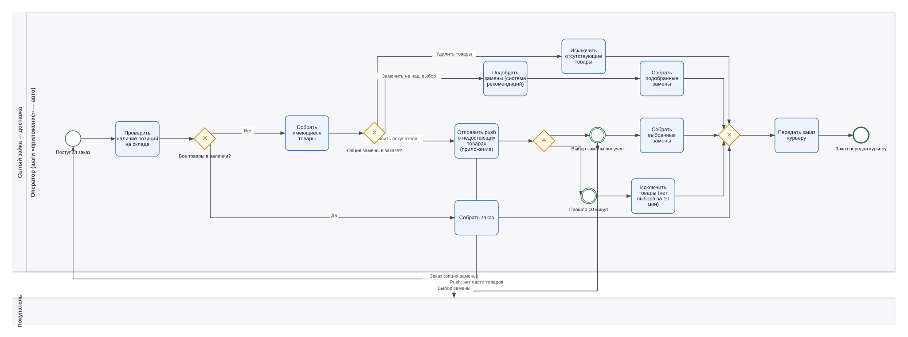

Портфолио бизнес-аналитика: BPMN
Здесь я собираю процессы, которые моделирую во время учёбы на курсе бизнес-аналитика (Яндекс).
Схемы рисую в нотации BPMN 2.0. Для процесса даю пару as-is и to-be
Кейс 01. Сытый зайка — доставка продуктов
Обработка заказа, когда части товаров нет на складе.
В версии as is оператор звонит покупателю и согласовывает замены вручную, так же оператор дважды проходит по складу, чтобы убедится в наличии товара + собрать заказ.
В версии to be звонок заменён на push в приложении: покупатель заранее выбирает правило замены, а процесс ждёт ответа с таймером на 10 минут. Ответил, собираем выбранные замены.
Как есть (as-is)

Как должно быть (to-be)

Файлы
`sytyi-zayka-as-is.bpmn`, `sytyi-zayka-to-be.bpmn` — исходники, открываются в bpmn.io, Camunda Modeler или draw.io
`as-is.svg`, `to-be.svg` — экспорт схем
Обо мне
Прохожу курс бизнес-аналитика (Яндекс). Учу Python + pandas и SQL, интересуюсь продуктовой аналитикой. 10+ лет в ритейле, е-комерс, фуд теке, в коммерческом отделе.
Telegram: @LoadedDice
